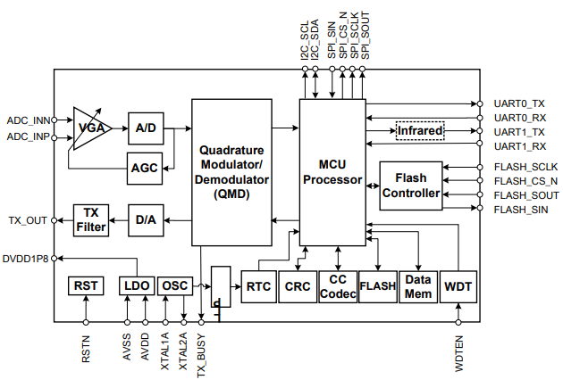

# [HT8550](https://doc.soc.xin/HT8550)

* [hitrendtech](http://www.hitrendtech.com/): [MCS-51](https://github.com/SoCXin/MCS-51)
* [L1R1](https://github.com/SoCXin/Level): 20 MHz，[￥2.9](https://item.szlcsc.com/193507.html)

## [简介](https://github.com/SoCXin/HT8550/wiki)

[HT8550](https://github.com/SoCXin/HT8550)基于0.162um CMOS工艺，是一款高性能电力线载波通信芯片，采用先进的数模混合设计技术与工艺，提供低功耗、高灵敏度、高抗干扰能力的电力线数据通信，可实现各种类型的数据传输及远程抄表应用。HT8550是高集成度SOC芯片，它将模拟前端、数字调制解调、基带数据处理和8051MCU以及FLASH存储器等模块完全在单芯片上实现。

HT8550支持多种模式及双载波发送与接收，包括通信的载波频率、双载波间隔，传输速率以及调制方式均可灵活配置。HT8550内部集成12bit高精度ADC、45dB动态范围信号放大器、自动增益控制环路，使模拟信号接收处理得到进一步优化；内置10比特DAC及低通滤波器，使得发送时产生的带外干扰得以抑制，HT8550支持时域分集接收技术可有效提高对抗电力线脉冲干扰能力；支持双载波频域分集模式可极大增强对抗频域窄带干扰性能。

HT8550采用DPSK调制方式、高效可靠的前向纠错技术、可灵活配置的传输模式，使其可以在各种不同噪声的电力线环境下实现自适应可靠通信。HT8550片内集成8051内核，支持多种外围接口，并能够完成MAC层及以上协议层所需各种功能及应用。

### 关键特性

* 20 MHz 8051 Core
* 8KB SRAM + 128KB FLASH
* DPSK调制方式、高效可靠的前向纠错技术、可灵活配置的传输模式
* DBPSK，DQPSK，D8PSK
* 调制方式：DBPSK，DQPSK，D8PSK
* 片内集成12位ADC和高动态范围自动增益控制电路
* 片内集成45dB可变增益放大器
* 片内集成10位DAC
* 可编程载波：3~500kHz
* 接收灵敏度优于0dBuV
* 符号传输速率可调，最高可达41.67Kbaud，净数据传输率最高可达55Kbps
* 推荐符号速率15.625Kbaud，净数据传输率2.524Kbps
* 支持长包传输：255字节
* 支持时域重叠交织及分集接收技术支持频域分集接收技术：双载波模式
* 可编程卷积编码效率：1/2，3/4
* 支持芯片工作状态监控：接收信号强度指示，接收信噪比
* 可动态配置传输模式
* 片内集成硬件看门狗电路
* 内置低功耗RTC
* 支持UART、SPI、I2C
* 支持多种DMA方式等接口
* 支持ALC功能

## [资源收录](https://github.com/SoCXin)

* [参考资源](src/)
* [相关文档](docs/)
* [典型应用](project/)

## [选型建议](https://github.com/SoCXin)

### [HT8580](https://www.hitrendtech.com/list_product/41)

最新型号HT8580是一款支持DPSK调制方式的高性能电力线载波通信芯片，采用先进的数模混合设计工艺。HT8580是集低功耗、高灵敏度、低带外干扰的电力线载波通信芯片，可实现各种类型的数据传输及远程抄表应用。HT8580是高集成度SOC芯片，它将模拟前端、数字调制解调、基带数据处理和8051 MCU以及FLASH存储器等模块完全在单芯片上实现。支持多种外围接口，并能够完成MAC层及以上协议层所需各种功能及应用。

HT8580支持多种模式及双载波发送与接收，包括通信的载波频率、双载波间隔、传输速率以及调制方式均可灵活配置。HT8580内部集成12bit高精度ADC、45dB动态范围信号放大器、自动增益控制环路，使模拟信号接收处理得到进一步优化；内置10比特DAC及低通滤波器，使得发送时产生的带外干扰得以抑制，HT8580支持时域分集接收技术可有效提高对抗电力线脉冲干扰能力；支持双载波频域分集模式可增强对抗频域窄带干扰性能。HT8580内部采用高效可靠的前向纠错技术、可灵活配置的传输模式，使其可以在各种不同噪声的电力线环境下实现自适应可靠通信。

### [HT8910](https://www.hitrendtech.com/list_product/40)

HT8910通过PRIME(PoweRline Intelligent Metering Evolution)标准认证的高性能电力线载波通信芯片。HT8910采用先进的数模混合设计技术与工艺，提供低功耗、高灵敏 度、高抗干扰能力的电力线数据通信，可实现各种类型的数据传输及远程抄表应用。

HT8910是高集成度SOC芯片，它将模拟前端、数字调制解调、基带数据处理、8051 MCU 以及FLASH存储器等模块在单芯片上实现高度集成。HT8910内部集成10bit高精度ADC、66dB 动态范围信号放大器、自动增益控制环路，使模拟信号接收处理得到进一步优化；内置10比特 DAC及低通滤波器，使得发送时产生的带外干扰得以抑制；内置单频干扰处理模块，可极大 增强对抗频域窄带干扰性能。

HT8910按照PRIME标准规定，物理层采用DPSK调制方式，支持DPBSK、DQPSK及D8PSK 以实现不同的传输模式，支持1/2码率卷积编码可实现可靠的前向纠错技术，支持97个子载波 实现多通道数据传输，使其可以在各种不同复杂噪声的电力线环境下实现可靠通信。

HT8910片内集成8051内核，并内置大容量SRAM内存单元与FLASH存储单元，可满足 PRIME MAC层、Convergence层以及不同应用层所要求的相应协议功能。

### [HT8922](https://www.hitrendtech.com/list_product/39)

HT8922是基于OFDM调制解调技术的第三代电力线载波通信芯片，采用先进的数模混合设计技术与工艺，提供高速率、高可靠性、高灵敏度的电力线数据通信，可实现各种类型的数据传输及远程抄表应用。

HT8922是高集成度SOC芯片，它将模拟电路、数字信号处理器以及ARM Cortex-M0完全在单芯片上实现。HT8922采用正交频分复用(OFDM)调制解调方式、高效可靠的前向纠错技术、灵活可配的传输模式，使其可以在信号衰减严重以及脉冲干扰强烈的电力线环境下实现自适应可靠通信。HT8922集成的Cortex-M0内核能够完成MAC层及以上协议层所需的各种功能及应用。

HT8922物理层协议完全兼容G3-PLC国际标准，并根据电力线载波环境的特点做了进一步性能优化。HT8922最高可支持2048子载波，支持相干和差分PSK调制方式，支持BPSK、QPSK、8PSK及16QAM等调制模式，可根据电力线信道特性选择相应的速率模式，支持多种卷积编码，以及级联Reed-Solomon编码等前向纠错技术，使其在复杂的电力线噪声环境下均可实现可靠通信。

### [探索芯世界 www.SoC.Xin](http://www.SoC.Xin)
